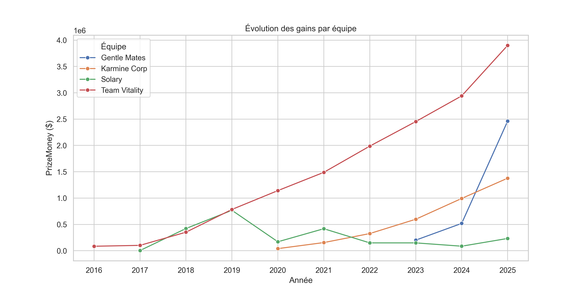
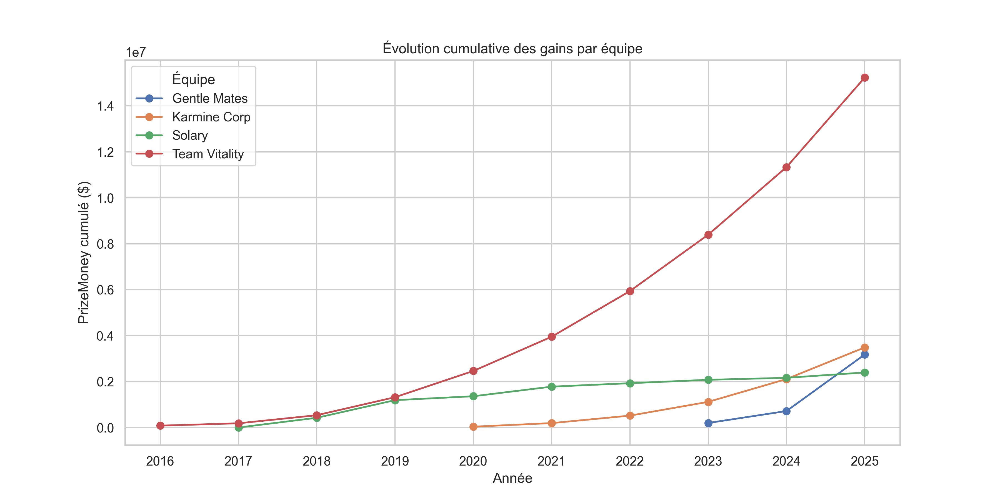
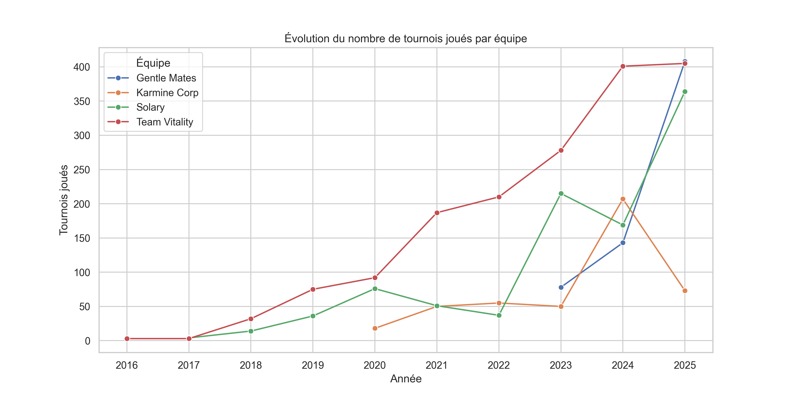
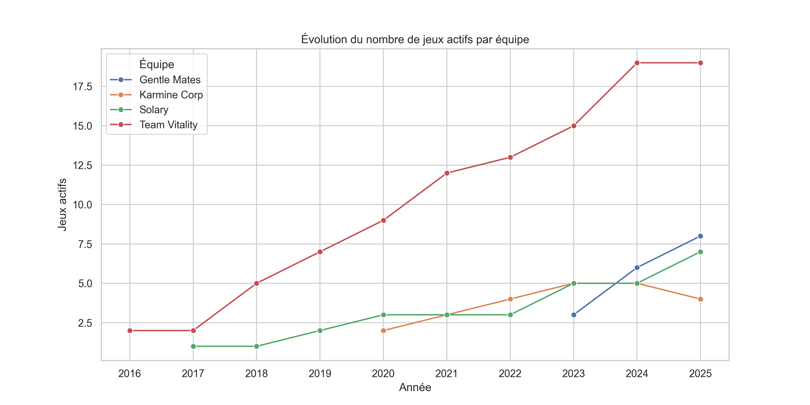
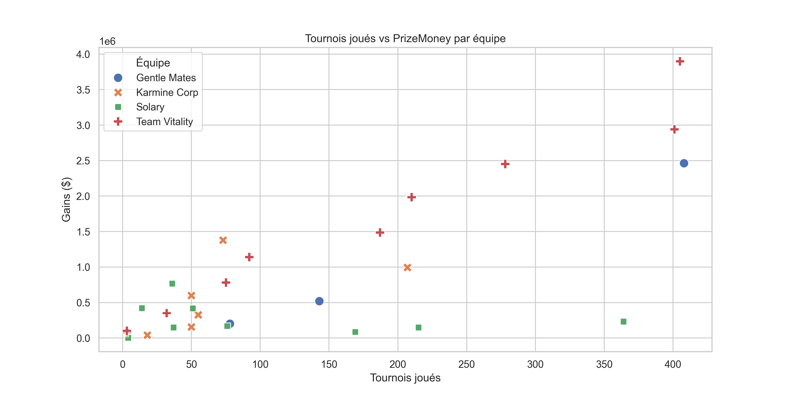
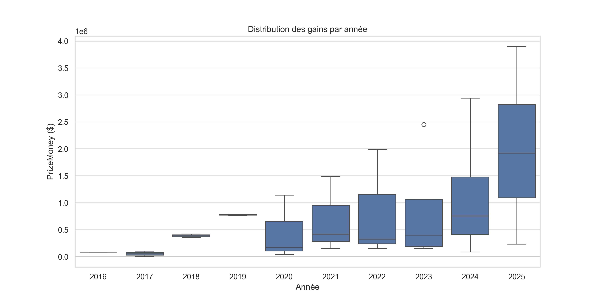
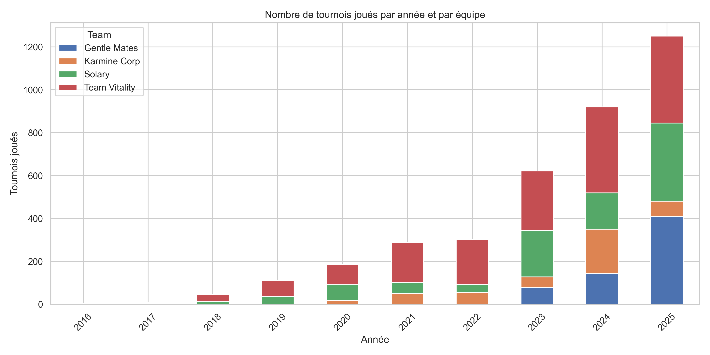
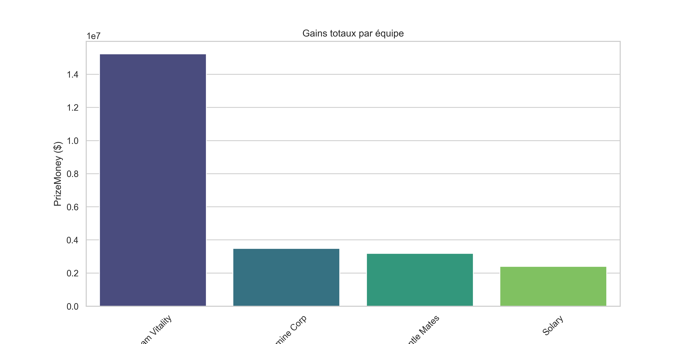
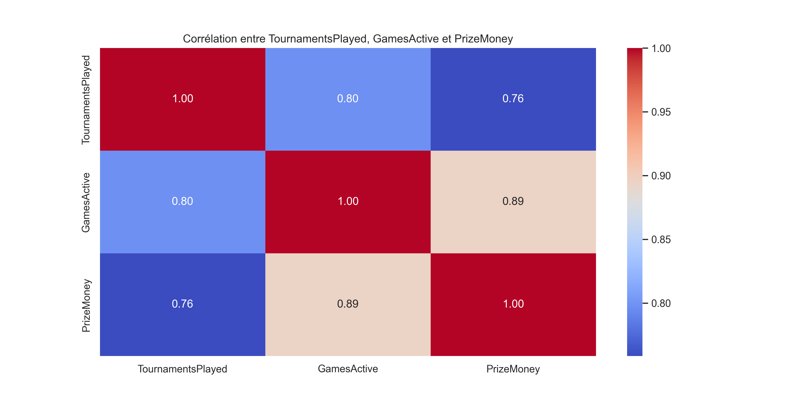

# French Esports Growth 📈🎮

 
 
  

Analyse la croissance des clubs e-sports français : **Karmine Corp, Team Vitality, Solary, Gentle Mates**.  
Suivi des tournois joués, des jeux actifs et des gains au fil des années.

---

## 🔍 Objectifs

- Suivre l’évolution du **PrizeMoney** des équipes françaises.  
- Analyser le nombre de **tournois joués** et les **jeux actifs** par équipe.  
- Visualiser les tendances et corrélations entre les variables de performance.  
- Fournir un dataset consolidé pour analyses ou projets de data science.

---

## 📁 Contenu du projet

### Graphiques (`graphs/`)

| Graphique | Aperçu | Description |
|------------|--------|-------------|
| `prizemoney.png` |  | Evolution du PrizeMoney par équipe dans le temps. |
| `cumulative_prizemoney.png` |  | Evolution cumulée des PrizeMoney par équipe. |
| `tournaments_played.png` |  | Nombre de tournois joués par équipe et par année. |
| `games_active.png` |  | Nombre de jeux actifs par équipe et par année. |
| `scatter_tournaments_prizemoney.png` |  | Relation entre tournois joués et PrizeMoney. |
| `boxplot_prizemoney.png` |  | Boxplot des PrizeMoney par équipe. |
| `stacked_tournaments.png` |  | Tournois joués empilés par équipe. |
| `total_prizemoney.png` |  | Total PrizeMoney par équipe. |
| `correlation_heatmap.png` |  | Heatmap des corrélations entre variables. |

### Scripts (`Scripts/`)

| Fichier | Description |
|---------|-------------|
| `scrap-esports.py` | Scraping des données depuis **Liquipedia**. |
| `merge_csv.py` | Fusionne plusieurs CSV pour créer le dataset final. |
| `analyses.py` | Génère tous les graphiques à partir du dataset final. |

### Datasets (`Datasets/`)

| Fichier | Description |
|---------|-------------|
| `esports_dataset.csv` | Données des équipes (sans PrizeMoney). |
| `Team_PrizeMoney.csv` | Données PrizeMoney récupérées par équipe. |
| `merged_esports.csv` | Fusion finale des données consolidées pour analyse. |

---

## 🔗 Sources

- [Liquipedia](https://liquipedia.net/) – Pour les données sur les équipes et tournois et cashprizes.  
- Données internes consolidées dans les CSV.